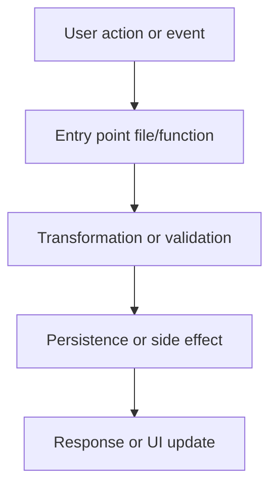
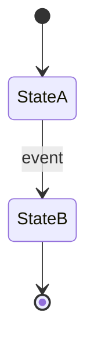

# Plan Task

Produce a plan document for a single issue before writing any implementation code. The plan is the reference point that `self-check` will verify the implementation against after the work is done.

## When to use

- Invoked programmatically by the coding agent spawned by `exec-tasks` in Phase 4 (spawn agents), as the agent's **first action** before any code is written.
- Not a user-facing slash command.

## Inputs

- `issue_number` — the GitHub issue this plan is for
- The context package at `.memory/plans/<issue_number>-context.md` (produced by `prepare-context`). Read it first.
- The issue body itself (re-read for acceptance criteria)

## Output

A single file at `.memory/plans/<issue_number>-plan.md` with the structure defined in `docs/WORKFLOW_CONTRACT.md` §8.

## Workflow

### Step 1: Read inputs

1. Read `.memory/plans/<issue_number>-context.md` end-to-end
2. Read the issue body via `gh issue view <issue_number> --repo <repo> --json body,title,labels`
3. Read `CLAUDE.md` to understand the project's conventions and check command
4. Read every ADR in `docs/adr/` — identify which ones constrain this task

### Step 2: Draft the approach

Before filling in the template, think through:

- **What files will change?** List every file you expect to create, modify, or delete. Be concrete — not "the state management layer" but `src/stores/foo.ts`.
- **What's the data shape?** If the task introduces or modifies a type/schema, sketch it now.
- **What's the control flow?** How does a user action or event propagate through the system? This becomes the system flow diagram.
- **What states exist?** If the feature has distinct states (loading/ready/error, or a domain state machine), this becomes the second diagram. If there are no distinct states, the second diagram is a data model instead.
- **What could go wrong?** Constraints from ADRs, edge cases from acceptance criteria, dependencies on other unfinished work.

### Step 3: Write the plan document

Write `.memory/plans/<issue_number>-plan.md` with this exact structure. All sections are mandatory except where marked.

```markdown
# Plan: Issue #<N> — <title>

**Generated:** <ISO-8601 timestamp>
**Contract version:** 2
**Context package:** [.memory/plans/<N>-context.md](./<N>-context.md)

## Summary
<2–3 sentences: what this task accomplishes and why>

## Approach
<A numbered list of the implementation steps in order. 5–10 items. Each step is a discrete, verifiable change.>

1. <step 1>
2. <step 2>
...

## Constraints
<ADR-imposed or convention-imposed constraints that affect this task. Reference ADRs by number.>

- **ADR-<N>** (<title>): <how it constrains this task>
- ...

(or "None" if no ADR constrains this task)

## File manifest

Files that will be **created**:
- `path/to/new.ext` — <one-line purpose>

Files that will be **modified**:
- `path/to/existing.ext` — <one-line description of change>

Files that will be **deleted**:
- `path/to/removed.ext` — <reason>

(omit the "deleted" subsection if empty)

## Data model
<Only if this task introduces or modifies types, schemas, or persisted state. Otherwise write "No data model changes.">

```typescript
// Or whatever the project's primary language is
type Example = {
  field: string;
};
```

## System flow diagram



<Describe what the diagram shows in 1–2 sentences under it. Every node referenced in the diagram MUST correspond to a real file, function, or component that will exist after this task is implemented.>

## State model / Data model diagram



<Or a classDiagram / erDiagram if the task is data-shape-focused rather than state-machine-focused. Pick the diagram type that fits — one diagram, not both.>

<Describe what the diagram shows in 1–2 sentences under it.>

## Acceptance criteria
<Copy verbatim from the issue body's Acceptance Criteria section. Do not paraphrase. This is what self-check will verify.>

- [ ] <criterion 1>
- [ ] <criterion 2>
- ...

## Test plan
<For each acceptance criterion, name the specific test case(s) that will verify it. Be concrete — name the test file and what it asserts.>

- **<criterion 1>** → `<test/file.test.ext>`: `<test name or description>`
- ...

## Open questions
<Anything the agent is unsure about that a human should resolve before merge. Use the same format as the issue comment thread. If none, write "None">

- ...
```

### Step 4: Validate the plan before returning

Before reporting success, verify:

1. Every file in the **file manifest** exists as a path the agent can reach (for "modified" files) or is in a directory the agent can write to (for "created" files).
2. Both mermaid code blocks parse as valid mermaid syntax. If you're unsure, keep the syntax minimal — `flowchart TD` and `stateDiagram-v2` are the safest choices.
3. Every acceptance criterion from the issue is present in the plan's "Acceptance criteria" section, verbatim.
4. Every node referenced in the system flow diagram has a corresponding entry in the file manifest (or is a pre-existing file you'll call into).

If any of these fail, fix the plan before declaring it done.

## Rules

- **Plan first, code second.** Never skip this skill to "save time." The plan is what `self-check` compares against; without it, self-check cannot run.
- **Two diagrams, both mermaid, both meaningful.** If you cannot produce a meaningful second diagram because the task is genuinely stateless and data-shapeless (rare), write a minimal `classDiagram` showing the function signatures that will change. Never write a placeholder diagram.
- **Verbatim acceptance criteria.** Do not paraphrase or reorder. Self-check parses them literally.
- **No prose padding.** Every sentence in the plan must carry information the implementer or reviewer needs. Cut anything that would be skimmed past.
- **File manifest is a commitment.** Self-check will verify that the implementation touched exactly the files listed — no more, no fewer. If you discover mid-implementation that you need a file not in the manifest, update the plan document first, then write the code.
