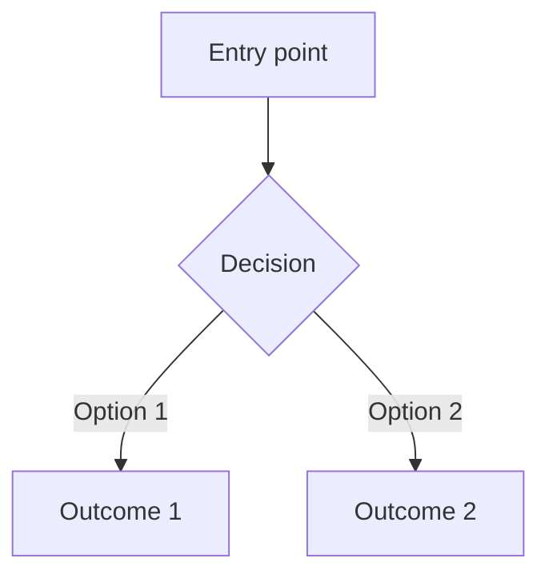
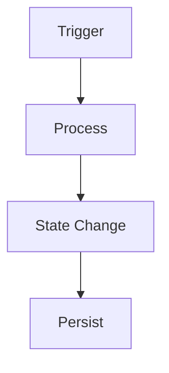

# Feature Documentation Generator

Review an implemented feature and produce a concise reference document with mermaid diagrams in `docs/features/`. This document is the authoritative post-implementation reference — written from the actual code, not the plan.

## When to use

- Called automatically by `/plan-feature` at close-out (Step 5) after all feature issues are merged
- To document an existing feature that lacks documentation
- After significant refactoring of an existing feature
- When the user says `/doc-feature` followed by a feature name

## Workflow

### Step 1: Analyze the implementation

Read the codebase to understand what was actually built:

- Identify the feature's entry points (routes, event handlers, exported functions, UI screens)
- Read `.memory/plans/{feature-name}.md` if it exists — use it to understand *original intent*, but document *actual behavior* (the two may have diverged during implementation)
- Read relevant source files: types, data models, state management, core logic, UI components, utilities
- Read `docs/glossary.md` — use canonical project terms in the doc
- Trace the data flow from entry point through processing, state changes, and persistence

### Step 2: Generate the document

Create `docs/features/{feature-name}.md` using the template below. If `docs/features/` doesn't exist, create it.

The document must reflect the *actual* implementation. If the implementation diverged from the plan, document what was built. Plans record intent; feature docs record reality.

### Step 3: Review with user

Present a summary of the generated doc and ask for approval. Call out any places where the implementation notably diverged from the original plan — those gaps are often worth an ADR or a note in the next plan.

## Document template

````markdown
# {Feature Name}

**Last Updated:** {date}

## Summary

2–3 sentences describing what this feature does from the user's perspective.

## User Flow



Step-by-step description of what the user experiences when this feature is active.

## System Flow



How data moves through the system when this feature is exercised. Every node that looks like a file path, function, or type name must correspond to a real artifact in the codebase.

## Data Model

Key types or schemas involved (reference only — don't duplicate; link to the source file):

```typescript
// from src/types/{file}.ts
type Example = {
  id: string;
  // key fields only
};
```

Write "No dedicated data model." if the feature operates entirely on existing types.

## State & Side Effects

Runtime state this feature owns or modifies (store slices, context, module-level state). Side effects it produces (network calls, file I/O, events, timers). Write "None." if purely computational.

## Key Files

| File | Role |
|---|---|
| `src/types/example.ts` | Type definitions |
| `src/store/exampleStore.ts` | State management |
| `src/screens/ExampleScreen.tsx` | UI entry point |

## Design Decisions

Non-obvious choices in the implementation and why they were made. Only include decisions a future contributor would need to understand the code — not obvious ones. Cross-reference any ADRs that document the same decision.
````

## Rules

- **Document what was built, not what was planned.** If the implementation diverged from the plan, the doc reflects reality.
- **Both diagrams are required.** Every feature doc must have at minimum a system flow diagram. Include the user flow diagram when the feature has meaningful user interaction — skip it only for purely internal/engine features, and note the omission.
- **Diagram nodes must be real.** Every node that looks like a file path, function name, or type must correspond to something that actually exists in the codebase after implementation. Abstract labels (`[User]`, `[Database]`) are acceptable; invented code symbols are not.
- **Keep it concise.** This is a reference doc, not a tutorial. Link to source files rather than duplicating code.
- **Use consistent naming.** File name matches the feature name in kebab-case: `docs/features/recruiting-system.md`.
- **Update, don't accumulate.** When a feature is significantly modified, update its existing doc rather than creating a new one. The "Last Updated" field tracks freshness.
- **Use the project's glossary terms.** Read `docs/glossary.md` and use the canonical names throughout — don't introduce synonyms.
