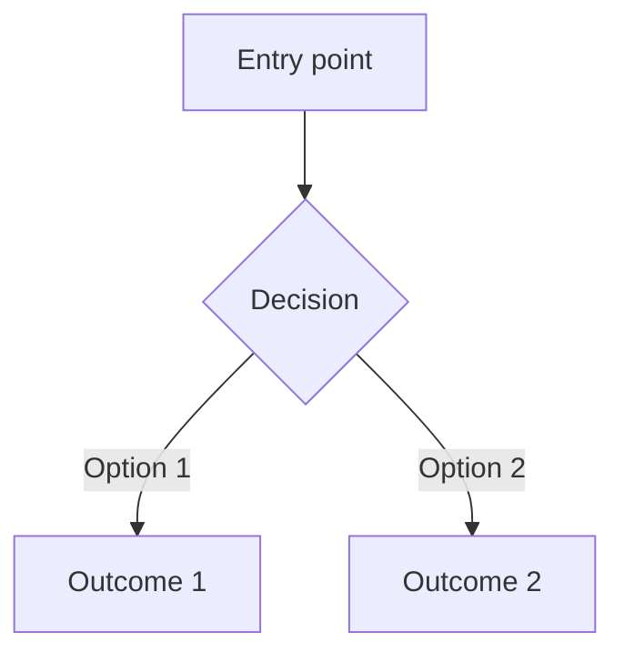
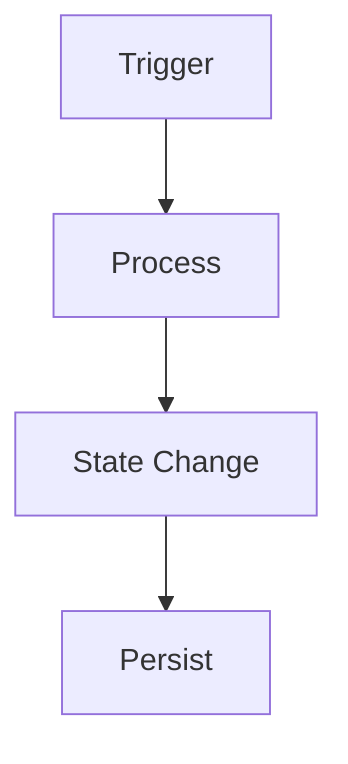

# Feature Planner

Design a feature before any implementation code is written. Produces a structured plan, extracts architectural decisions, and converts the plan into GitHub issues that `exec-tasks` can execute.

## When to use

- When the user says `/plan-feature` followed by a feature name or description
- Before starting any significant feature, new system, or cross-cutting change
- When `exec-tasks` surfaces a task that requires design decisions not covered by the PRD or ADRs — stop, run this skill first

## Workflow Contract

This skill writes GitHub issues conforming to [`docs/WORKFLOW_CONTRACT.md`](../../../docs/WORKFLOW_CONTRACT.md) (contract version 3). The workflow contract specifies the exact issue body template, label vocabulary, milestone naming, and dependency syntax that `exec-tasks` expects to read.

## Workflow

### Step 0: Assess complexity

Before planning, classify the request:

- **High complexity** (multiple interacting subsystems, unclear requirements, many open design questions): recommend the user run `/grill-me` first to stress-test the design and resolve ambiguities before planning. Offer this explicitly — don't just proceed.
- **Medium complexity** (clear requirements but multiple phases of work): proceed with planning normally.
- **Too broad** (e.g., "build the whole auth system" when it spans token management, session persistence, refresh flows, and UI): suggest breaking it into smaller, independently plannable features. Propose the breakdown and let the user confirm before proceeding.

When in doubt, suggest a breakdown. Smaller plans are easier to execute, review, and course-correct.

### Step 1: Research

Before writing the plan, gather context:

- Read `.memory/` for existing specs and decisions related to this feature
- Read `docs/PRD.md` for the relevant product requirements
- Read `docs/glossary.md` for domain vocabulary — use the project's canonical terms in the plan
- Read every ADR in `docs/adr/` — identify which ones constrain this feature
- Read `CLAUDE.md` for project conventions, tech stack, and the check command
- Explore the current codebase to understand what already exists and what this feature depends on

### Step 2: Create the plan document

Create `.memory/plans/{feature-name}.md` using the template in the **Plan template** section below. If `.memory/plans/` doesn't exist, create it with a `.gitkeep`.

Fill every section. "Open Questions" is the only section that may be "None."

### Step 2.5: Extract ADRs

Review the **Design Decisions** section of the draft plan. Any decision that is **architectural** — meaning it affects multiple features, establishes a project-wide pattern, or would surprise a future contributor — should be extracted into an ADR at `docs/adr/`.

An architectural decision is one that:
- Constrains how future code is written (e.g., "no barrel exports", "errors returned not thrown")
- Establishes a pattern other features must follow (e.g., "shared types live in domain-neutral files")
- Involves a non-obvious tradeoff worth recording (e.g., "optimistic UI update over server-confirmed because latency matters more than consistency here")

Feature-specific decisions (e.g., "named this type `SessionToken` to avoid a DOM clash") stay in the plan's Design Decisions section — they don't need an ADR.

ADR format:

```markdown
# ADR-{number}: {Title}

**Date:** {date}
**Status:** Accepted

## Context

What situation or problem prompted this decision?

## Decision

What was decided, stated concisely.

## Consequences

What follows from this decision — both positive tradeoffs and constraints it imposes.
```

Number ADRs sequentially after the last existing one in `docs/adr/`.

### Step 3: Review with user

Present a plan summary and ask for approval before creating any GitHub issues. Include in the summary:

- Feature overview in one paragraph
- Proposed implementation phases (how many, rough scope of each)
- Any proposed ADRs (title + one-line rationale)
- Open questions that need resolution before implementation
- Proposed milestone for the issues

Do not proceed to Step 4 until the user explicitly approves.

### Step 4: Create GitHub issues

Convert the plan's implementation phases into GitHub issues conforming to the workflow contract (v3).

**Before creating issues:**
1. Determine the target milestone: run `gh milestone list --repo <repo>` and use the earliest incomplete one, or ask the user if ambiguous.
2. Assign each phase a priority label (`P0`–`P3`) and type label (`type:feature`, `type:bug`, `type:chore`, or `type:docs`).
3. Map inter-phase dependencies: later phases depend on earlier ones.

**Create each issue:**

```bash
gh issue create --repo "$REPO" \
  --title "<Phase title>" \
  --body "$(cat <<'EOF'
## Summary
<one-sentence description of what this phase accomplishes>

## Acceptance Criteria
- <criterion 1 — testable outcome>
- <criterion 2>
- <criterion 3>

## Priority
P<n>

## Depends on
<#N, #M or none>
EOF
)" \
  --label "P<n>" \
  --label "type:<type>" \
  --milestone "<milestone>"
```

Create issues in dependency order (earliest phase first) so GitHub assigns numbers in the correct order for cross-referencing.

**After all issues are created**, update the plan document with a `## GitHub Issues` section:

```markdown
## GitHub Issues

| Phase | Issue | Priority |
|---|---|---|
| Phase 1: {name} | #{n} | P{n} |
| Phase 2: {name} | #{n} | P{n} |
```

### Step 5: Close out (called after all feature issues are merged)

When all the feature's GitHub issues have been merged and the feature is live, run this close-out:

1. Update the plan status to "Complete" and set the last-updated date.
2. Extract any new architectural decisions that emerged **during implementation** (beyond those captured in Step 2.5) into ADRs at `docs/adr/`.
3. Invoke the **`doc-feature` sub-skill** to generate `docs/features/{feature-name}.md` — this reads the *actual implementation* (not the plan) and produces the authoritative reference doc with accurate mermaid diagrams for reviewers and future contributors.
4. Remove the plan file from `.memory/plans/` — the git history preserves it, and the feature doc in `docs/features/` is now the canonical reference.

## Plan template

````markdown
# Feature: {Feature Name}

**Status:** Planning | In Progress | Complete
**Created:** {date}
**Last Updated:** {date}
**PRD Reference:** Section {X.X} — or "None" if not in the PRD

## Overview

One paragraph describing what this feature does and why it matters. Written for a future contributor who hasn't read the issue thread.

## Dependencies

- [ ] {Feature or system that must exist before this one can be implemented}
- [ ] {Another prerequisite — or remove this section if none}

## User Flow



Step-by-step description of what the user experiences.

## System Flow



How data moves through the system when this feature is exercised.

## Data Model

New or modified types, schemas, or data structures:

```typescript
// or the project's primary language
type Example = {
  id: string;
  // key fields only
};
```

Write "No data model changes." if none.

## State & Side Effects

Any runtime state changes, side effects (network calls, file I/O, events), or persistence concerns this feature introduces or modifies. Write "None." if purely computational.

## Implementation Phases

### Phase 1: {Phase name}
- [ ] Task 1
- [ ] Task 2

### Phase 2: {Phase name}
- [ ] Task 1
- [ ] Task 2

(add phases as needed; each phase becomes one GitHub issue)

## File Manifest

| File | Action | Purpose |
|---|---|---|
| `src/example.ts` | Create | Type definitions |
| `src/store/example.ts` | Modify | Add new slice |

## Test Scenarios

- [ ] {Scenario 1: what to verify end-to-end}
- [ ] {Scenario 2}

## Design Decisions

Document non-obvious choices and why:

- **Decision:** {what was decided}
  **Why:** {rationale}

(Architectural decisions go to ADRs in Step 2.5; feature-specific ones stay here.)

## Open Questions

- {Any unresolved questions for the user or future implementer — or "None."}

## GitHub Issues

<!-- Filled in after Step 4 — one row per phase -->
````

## Rules

- **Never skip planning.** Even medium-sized features benefit from a plan. Scale detail to complexity.
- **Two diagrams are not optional.** Every plan must include both user flow and system flow mermaid diagrams. If the feature has no meaningful user interaction, the user flow diagram can be a single-node "internal only" diagram — but it must be present.
- **Don't proceed to issue creation without user approval.** Step 3 is a hard gate.
- **Issues must conform to the workflow contract.** The body template, label names, and milestone format are fixed — `exec-tasks` parses them literally. Any deviation breaks the pipeline.
- **Create issues in phase order.** GitHub assigns numbers sequentially; creating in order ensures `Depends on: #N` links are correct.
- **Plans are living documents.** Update the plan during implementation if the approach changes. Stale plans mislead reviewers.
- **One plan per feature.** If features are tightly coupled, note the dependency but keep plans separate.
- **Reference, don't duplicate.** Point to PRD sections and `.memory/` docs rather than copying content into the plan.
- **Close out with `doc-feature`.** The plan captures intent; `doc-feature` captures reality. Reviewers and future contributors need both.
